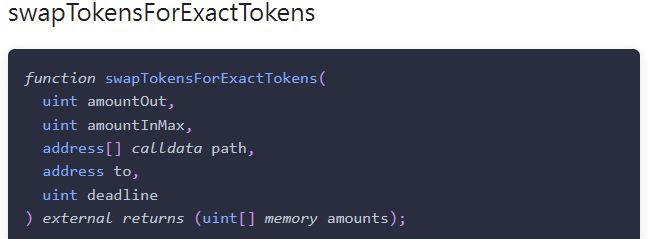

# 2024-Spring-HW2

Please complete the report problem below:

## Problem 1
Provide your profitable path, the amountIn, amountOut value for each swap, and your final reward (your tokenB balance).

> Solution
\
B->A    amountIn:5 amountOut:5.655321988655322\
A->D    amountIn:5.655321988655322 amountOut:2.4587813170979333\
D->C    amountIn:2.4587813170979333 amountOut:5.0889272933015155\
C->B    amountIn:5.0889272933015155 amountOut:20.129888944077443\
final tokenB balance=20.1298889441

## Problem 2
What is slippage in AMM, and how does Uniswap V2 address this issue? Please illustrate with a function as an example.

> Solution
Slippage in AMM refers to the difference between the expected price of a trade and the actual price at which the trade is executed.Suppose we have a liquidity pool with 100 tokens of Asset A and 1000 tokens of Asset B. Therefore, 
x=100 and y=1000, and k=100×1000=100,000.Now, a trader wants to swap 10 tokens of Asset A for Asset B. Before the trade, the price of Asset A in terms of Asset B is y/x = 10. After the trade, the new quantities of assets in the pool will be x'=90 y'=1111.11
After the trade, the new quantities of assets in the pool will be calculated using the constant product formula.The new price of Asset A in terms of Asset B is y'/x'=12.34.The difference between the expected price (10) and the actual price (12.34) represents the slippage in this trade.\
Uniswap V2 allows traders to set a slippage tolerance, which determines how much the price can move against them before their transaction is reverted.Also, Uniswap support flash swap and token-to-token swaps.\ 
For example:

In the example,the amountOut is a static number which you define, and amountInMax is the maximum you are willing to input tokens A to get the static amount of tokens B.So your slippage tolerance is defined and controlled by amountInMax.

## Problem 3
Please examine the mint function in the UniswapV2Pair contract. Upon initial liquidity minting, a minimum liquidity is subtracted. What is the rationale behind this design?

> Solution
Uniswap v2 mints shares equal to the geometric mean of the amounts deposited .It is possible for the value of a liquidity pool share to grow over time, either by accumulating trading fees or through “donations” to the liquidity pool. This could result in a situation where the value of the minimum quantity of liquidity pool shares (1e-18 pool shares) is worth so much that it becomes infeasible for small liquidity providers to provide any liquidity. To mitigate this, Uniswap v2 burns the first 1e-15 (0.000000000000001) pool shares that are minted (1000 times the minimum quantity of pool shares), sending them to the zero address instead of to the minter.This mechanism can also prevent rounding errors. 
Also, Uniswap V2 needs defense against the inflation attack. Uniswap V2’s defense is to burn first MINIMUM_LIQUIDITY tokens to ensure no-one owns the entire supply of LP tokens and can easily manipulate the price.

## Problem 4
Investigate the minting function in the UniswapV2Pair contract. When depositing tokens (not for the first time), liquidity can only be obtained using a specific formula. What is the intention behind this?

> Solution
The user will get the worse of the two ratios (amount0 / _reserve0 or amount1 / _reserve1) they provide and this incentivizes them to increase the supply of token0 and token1 without changing the ratio of token0 and token1. Let’s say the pool currently has 100 of token0 and 1 of token1, and the supply of LP tokens is 1. Let’s say the total value, in dollars, of both tokens is $100 each, so the total value of the pool is $200.If we took the maximum of the two ratios, someone could supply one additional token1 (at a cost of $100) and raise the pool value to $300. They’ve increase the pool value by 50%. However, under the maximum calculation, they would get minted 1 LP tokens, meaning they own 50% of the supply of the LP tokens, since the total circulating supply is now 2 LP tokens. Now they control 50% of the $300 pool (worth $150) by only depositing $100 of value. This is clearly stealing from other LP providers.

## Problem 5
What is a sandwich attack, and how might it impact you when initiating a swap?

> Solution
A sandwich attack is a form of front-running.A sandwich attack involves “sandwiching” a user’s transactions in between two transactions. These two transactions are before and after the user's transaction (hence the name sandwich), generating a loss for the user and a gain for the attacker.In a sandwich attack, an attacker will first monitor for pending transactions in the mempool. Then He will find the user's transaction and place two trades, one before the victim’s pending transaction (front-running) and another trading order just after it (back-running). The victim’s pending transaction will be sandwiched between the two new trade orders created by the attacker.\
When initiating a swap in a DeFi platform susceptible to sandwich attacks, you might be impacted if your transaction gets executed between the attacker's two transactions. This could result in you receiving a less favorable exchange rate than expected, potentially leading to financial losses.

